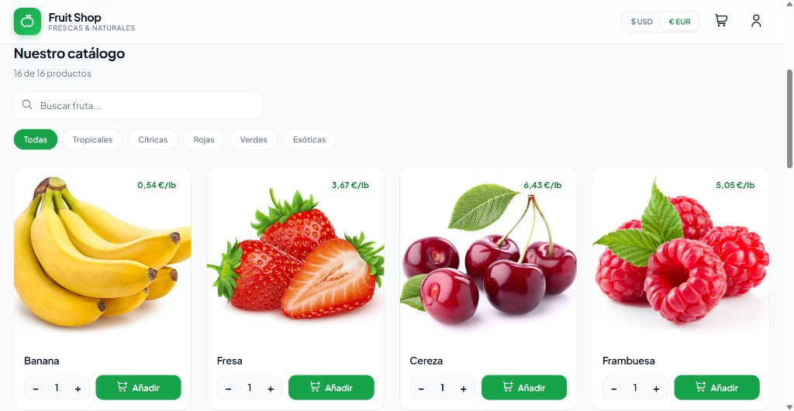
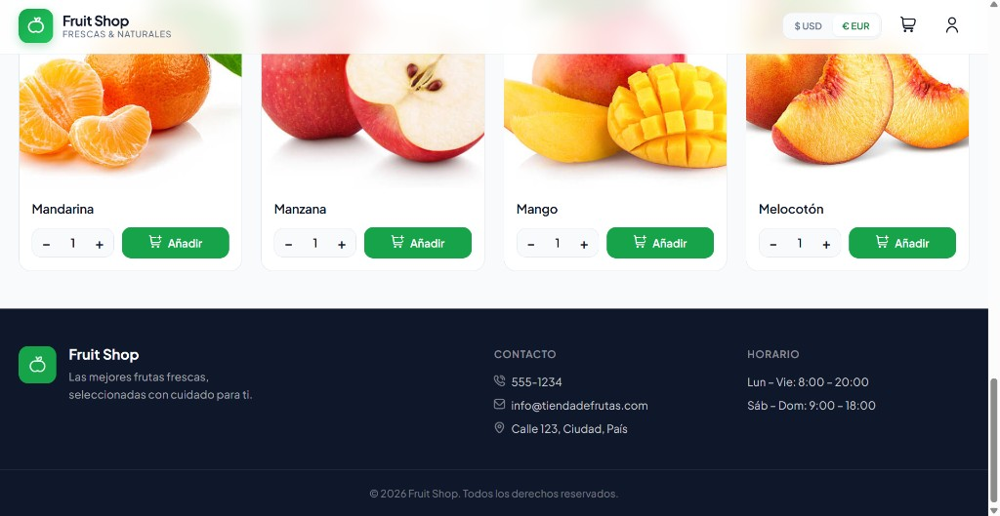

# Fruit Shop

<p align="center">
  
</p>

Tienda online de frutas frescas construida con Vue.js. Permite explorar el catálogo, gestionar un carrito de compra, autenticarse y completar el proceso de pago, con soporte multi-moneda (USD / EUR).

## Demostración

### Catálogo con búsqueda y filtros


### Productos y pie de página



## Características

- Catálogo de productos con categorías (tropical, cítrica, roja, verde, exótica)
- Carrito de compra con detalle de líneas y totales
- Autenticación de usuario (registro e inicio de sesión)
- Flujo de pago con datos de envío por provincia
- Selector de moneda (USD / EUR) con formato localizado
- Interfaz responsive orientada a escritorio y móvil
- Enrutamiento con Vue Router en modo history

## Stack tecnológico

| Tecnología | Uso |
| --- | --- |
| [Vue.js 2](https://v2.vuejs.org/) | Framework frontend |
| [Vue Router](https://v3.router.vuejs.org/) | Navegación SPA |
| [Vue Material](https://vuematerial.io/) | Componentes UI |
| [Vue CLI 5](https://cli.vuejs.org/) | Build y herramientas de desarrollo |
| Node.js 20 | Runtime requerido |

## Requisitos previos

- [Node.js](https://nodejs.org/) **20.x** (ver `.nvmrc`)
- npm o yarn

## Instalación

```bash
# Clonar el repositorio
git clone <url-del-repositorio>
cd Fruit-Shop-master

# Instalar dependencias
npm install --legacy-peer-deps
# o
yarn install
```

> El flag `--legacy-peer-deps` es necesario por compatibilidad de peer dependencies con Vue Material.

## Scripts disponibles

| Comando | Descripción |
| --- | --- |
| `npm run serve` | Servidor de desarrollo con hot-reload |
| `npm run build` | Compilación optimizada para producción (`dist/`) |
| `npm run lint` | Análisis y corrección de estilo con ESLint |

```bash
# Desarrollo
npm run serve

# Producción
npm run build
```

La app de desarrollo suele quedar disponible en `http://localhost:8080`.

## Estructura del proyecto

```
src/
├── assets/styles/     # Estilos globales y overrides
├── components/        # Componentes Vue (catálogo, carrito, auth, pago…)
├── data/              # Catálogo de productos y provincias
├── mixins/            # Mixins compartidos (moneda)
├── router/            # Definición de rutas
├── utils/             # Utilidades (cuenta de usuario, moneda)
├── App.vue
└── main.js
public/
└── images/            # Imágenes estáticas de productos
docs/                  # Capturas para el README
```

## Rutas

| Ruta | Vista |
| --- | --- |
| `/` | Inicio / catálogo |
| `/login` | Inicio de sesión |
| `/register` | Registro |
| `/payment` | Pago y envío |

## Despliegue

El proyecto incluye `vercel.json` listo para desplegar en [Vercel](https://vercel.com/):

- Instalación: `npm install --legacy-peer-deps`
- Build: `npm run build`
- Salida: `dist/`
- Rewrites SPA hacia `index.html`

## Configuración

Opciones adicionales de Vue CLI: [Configuration Reference](https://cli.vuejs.org/config/).

## Licencia

Proyecto privado (`private: true` en `package.json`).
